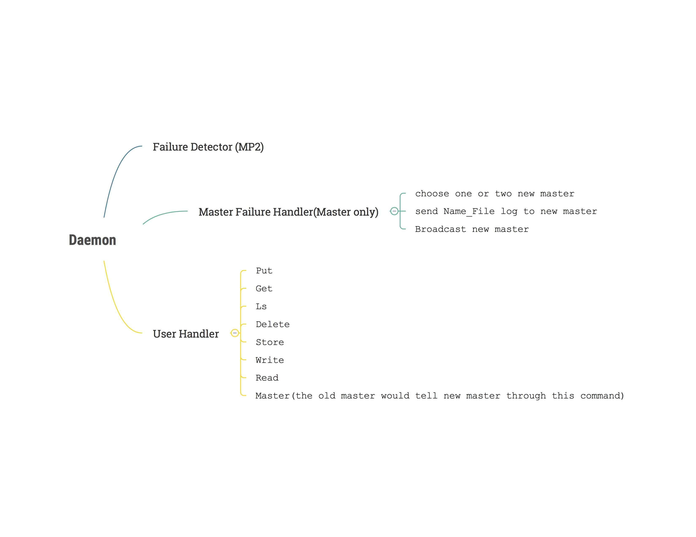

# CS425 MP3
## Gohar Irfan Chaudhry (gic2) and Yang Liu (liu310)
### Instructions/Notes
#### Build the project from a clean state:
```
mvn clean install
```

#### Start Daemon:
##### As a leader:
```
mvn exec:java -Dexec.mainClass="edu.illinois.cs.cs425.Daemon" -Dexec.args="-l -p <portNumber>"
```
```
E.g. mvn exec:java -Dexec.mainClass="edu.illinois.cs.cs425.Daemon" -Dexec.args="-l -p 6667"
```

#### Start Daemon:
##### As a master and a leader:
```
mvn exec:java -Dexec.mainClass="edu.illinois.cs.cs425.Daemon" -Dexec.args="-l -p <portNumber> -m"
```
```
E.g. mvn exec:java -Dexec.mainClass="edu.illinois.cs.cs425.Daemon" -Dexec.args="-l -p 6667 -m"
```

##### As a common member and master:
```
mvn exec:java -Dexec.mainClass="edu.illinois.cs.cs425.Daemon" -Dexec.args="-a <leaderHostName> -p <portNumber> -m"
```
```
E.g. mvn exec:java -Dexec.mainClass="edu.illinois.cs.cs425.Daemon" -Dexec.args="-a fa16-cs425-g10-01.cs.illinois.edu:6667 -p 6680 -m"
```

##### As a common member:
```
mvn exec:java -Dexec.mainClass="edu.illinois.cs.cs425.Daemon" -Dexec.args="-a <leaderHostName> -p <portNumber>"
```
```
E.g. mvn exec:java -Dexec.mainClass="edu.illinois.cs.cs425.Daemon" -Dexec.args="-a fa16-cs425-g10-01.cs.illinois.edu:6667 -p 6680"
```

#### Commands supported:
##### Put
```
put <local filename> <sdfs filename>
```
```
E.g. put a.gz b.gz
```

##### Get
```
get <sdfs filename> <local filename>
```
```
E.g. get a.gz b.gz
```

##### Delete
```
delete <sdfs filename>
```
```
E.g. delete a.gz
````

##### List files
To list all files
```
ls
```

To list particular file replicas
```
ls <sdfs filename>
```
```
E.g. ls a.gz
```

##### Stored files on a node
```
store
```

##### SDFS Directory
All SDFS files will be stored in a directory called _sdfsFile_ in each node.

_(Note: Default portNumber is 6667 if not specified. 
Reminder: portNumber-1 & portNumber-2 are automatically ocuppied.)_

_(Attention! cannot implement more than one leaders in a group!)_

### Architecture of the project

